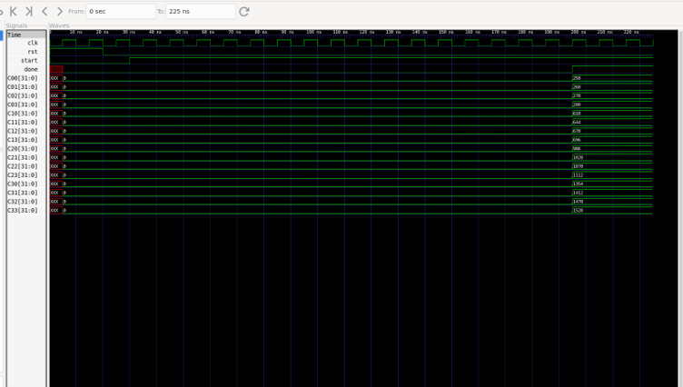

# INT8 Systolic Array AI Accelerator
**RTL-to-GDSII ASIC Implementation — Verilog + OpenLane / SKY130**

A 4×4, 16-PE output-stationary systolic array for INT8 matrix multiplication, written in Verilog, verified in simulation, and carried through a full RTL-to-GDSII flow on the open-source SKY130 PDK.


---

## Key Results

| Metric | Result |
|---|---:|
| Architecture | 4×4 output-stationary systolic array |
| Processing elements | 16 |
| Operand precision | INT8 (signed) |
| Accumulator width | 32-bit |
| Die area | 700 × 700 µm |
| Standard-cell area | 209,667 µm² |
| Routing utilization | 30.66% |
| Global routing overflow | 0 |
| Magic DRC violations | 0 |
| Clock constraint | 10 ns (100 MHz) |
| PDK / library | SKY130A / sky130_fd_sc_hd |

*Timing is a baseline result — see [Physical Implementation](#physical-implementation) below; optimization is in progress.*

---

## Architecture

The accelerator has four blocks: an **input buffer** that loads the two operand matrices and shifts them into the array in systolic order, the **4×4 systolic array** itself, an **output buffer** that latches the 16 result accumulators, and a **controller** FSM that sequences the whole operation.


The controller moves through six states — `IDLE → LOAD → FEED → FLUSH → STORE → DONE` — driving `load`, `shift_enable`, `enable`, and `store_enable` at the right cycles for data to propagate fully through the array before results are latched.

## Systolic Dataflow

Operand **A** is fed in from the left and moves right, one register per cycle; operand **B** is fed in from the top and moves down, one register per cycle. Each PE holds its inputs for exactly one cycle before forwarding them to its neighbor, which is what makes this a *systolic* array rather than a combinational grid — the diagonal wavefront is what lets the whole 4×4×4 multiply pipeline through the array instead of needing a giant combinational multiplier tree.


## RTL Design

### Processing Element ([`rtl/pe.v`](rtl/pe.v))

Each PE registers its `A_in`/`B_in` operands, forwards the registered values to its neighbors on `A_out`/`B_out`, and accumulates their product into a 32-bit `partial_sum` every enabled cycle:

```verilog
always @(posedge clk) begin
    if (rst) begin
        A_reg <= 0; B_reg <= 0; partial_sum <= 0;
    end else if (enable) begin
        A_reg <= A_in;
        B_reg <= B_in;
        partial_sum <= partial_sum + (A_reg * B_reg);
    end
end
```

Simulating the PE in isolation and dumping the waveform confirms the registered MAC behavior directly — note the one-cycle delay between an operand arriving on `A_in`/`B_in` and it showing up in `A_reg`/`B_reg`, and `partial_sum` accumulating 10 → 28 → 56 as products land:


### Systolic Array ([`rtl/systolic_array.v`](rtl/systolic_array.v))

Sixteen `pe` instances are wired into a 4×4 grid: each PE's `A_out` drives the `A_in` of the PE to its right, and each PE's `B_out` drives the `B_in` of the PE below it. The edge PEs' unused `A_out`/`B_out` ports are left open, since nothing consumes data flowing off the array. All 16 `partial_sum` outputs are exposed directly (output-stationary — each accumulator stays put in its own PE for the full computation).

### Top Level ([`rtl/top.v`](rtl/top.v))

`top.v` wires the controller, input buffer, systolic array, and output buffer together and exposes a simple handshake: drive `A_flat_in`/`B_flat_in` and pulse `start`, then wait for `done` before reading `C00..C33`.

## Verification

Four testbenches exercise the design at different levels: `pe_tb.v` and `systolic_array_tb.v` check individual PEs and the array in isolation, and `top_tb.v` / `top_tb_signed.v` / `top_tb_random.v` / `top_tb_identity.v` drive the full top-level module with known matrices and check the result against hand-computed expected output.

Running `top_tb.v` in Icarus Verilog with

```
A = [[1,2,3,4],[5,6,7,8],[9,10,11,12],[13,14,15,16]]
B = [[17,18,19,20],[21,22,23,24],[25,26,27,28],[29,30,31,32]]
```

produces `C = A×B` exactly, and the controller's FSM progression through LOAD → FEED → FLUSH → STORE → DONE is visible directly in the dumped waveform:



```
Final Result Matrix
==============================================
 250  260  270  280
 618  644  670  696
 986 1028 1070 1112
1354 1412 1470 1528
==============================================
```

## ASIC Implementation

The design goes through synthesis (Yosys) and place-and-route (OpenLane / OpenROAD) targeting the open-source **SKY130A** PDK and `sky130_fd_sc_hd` standard-cell library, producing a routed GDSII layout.

```
RTL  →  Yosys synthesis  →  gate-level netlist  →  floorplan  →  placement
     →  clock tree synthesis  →  routing  →  STA / DRC  →  GDSII
```

Configuration lives in [`asic/openlane/config.json`](asic/openlane/config.json); the synthesized gate-level netlist is checked in at [`asic/yosys/netlist/ai_accelerator_synth.v`](asic/yosys/netlist/ai_accelerator_synth.v).

## Physical Implementation

| Parameter | Value |
|---|---:|
| Technology | SKY130A |
| Standard-cell library | sky130_fd_sc_hd |
| Die | 700 × 700 µm |
| Die area | 490,000 µm² |
| Standard-cell area | 209,667 µm² |
| Routing utilization | 30.66% |
| Global routing overflow | 0 |
| Magic DRC violations | 0 |
| Clock period | 10 ns |

**Timing — baseline, before optimization**

| Metric | Worst case |
|---|---:|
| Setup WNS | −1.393 ns |
| Setup TNS | −216.420 ns |
| Hold WNS | −0.462 ns |
| Hold TNS | −86.566 ns |

The design is DRC-clean and routes with zero overflow, but the baseline synthesis strategy doesn't yet close timing at the 10 ns constraint. Closing setup/hold violations (retiming, pipelining the MAC, or relaxing the constraint) is the next milestone — see [Roadmap](#roadmap).

## Repository Structure

```
ai_accelerator/
├── rtl/                  # Synthesizable Verilog source
│   ├── pe.v
│   ├── systolic_array.v
│   ├── input_buffer.v
│   ├── output_buffer.v
│   ├── controller.v
│   └── top.v
├── tb/                   # Testbenches
│   ├── controller_tb.v
│   ├── input_buffer_tb.v
│   ├── input_buffer_systolic_tb.v
│   ├── output_buffer_tb.v
│   ├── systolic_array_tb.v
│   ├── top_tb.v
│   ├── top_tb_signed.v
│   ├── top_tb_identity.v
│   └── top_tb_random.v
├── asic/
│   ├── openlane/         # OpenLane config + RTL snapshot used for the ASIC run
│   └── yosys/netlist/    # Synthesized gate-level netlist
└── docs/
    ├── architecture/     # Block + dataflow diagrams
    └── waveforms/        # Simulation waveform captures
```

## Reproducing the Flow

**Simulation** (Icarus Verilog):
```bash
iverilog -o top_sim rtl/*.v tb/top_tb.v
vvp top_sim
```

**Synthesis + P&R** (requires [OpenLane](https://github.com/The-OpenROAD-Project/OpenLane)):
```bash
cd asic/openlane
openlane config.json
```

## Roadmap

- [ ] Close setup/hold timing at the 10 ns constraint (baseline currently violates both)
- [ ] Re-run P&R after timing fixes and publish before/after comparison
- [ ] Add power and area breakdown per block
- [ ] Explore a pipelined PE (2-stage MAC) to raise achievable Fmax
